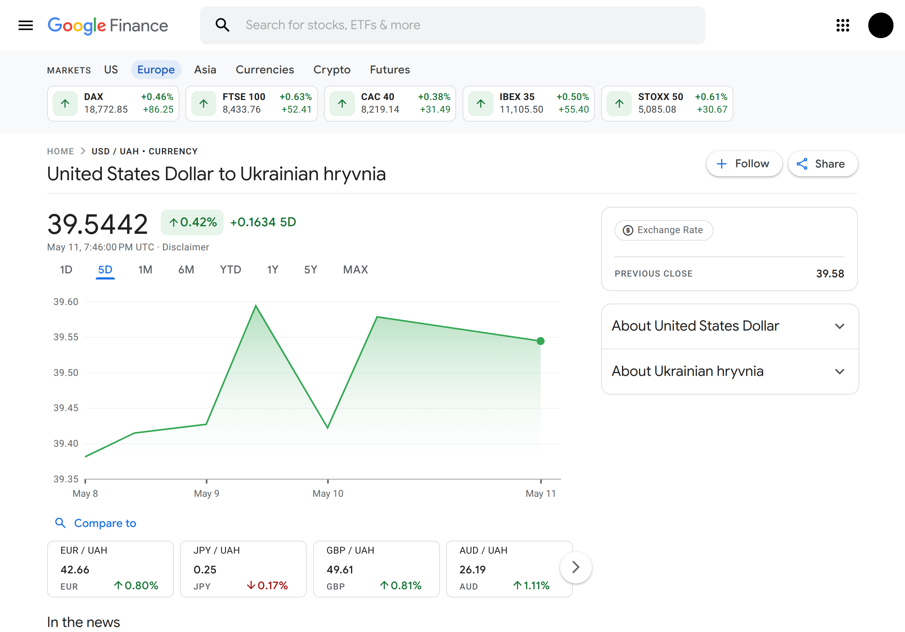

# Telegram Bot for Monitoring USD to UAH Rate


This project aims to regularly fetch the USD to UAH exchange rate from the Google Finance page, checking every hour. 
Once the data is gathered, it's stored in a database and then converted into an xlsx file. 
When a Telegram user requests the exchange rate using the /get_exchange_rate command, 
the bot promptly sends the file containing all the recorded rates for the current day.

## Stack Used
- Telegram bot: aiogram
- Web scraping: BeautifulSoup4
- Excel file handling: pandas + openpyxl
- Environment variable management: python-dotenv
- HTTP requests: requests
- Scheduling: schedule

## Get Started

To get started with this project, follow the next steps:

1. Clone the repository to your local machine:
```bash
git clone https://github.com/aLEKS-e3/currency-monitoring-bot.git
```

2. Set up a virtual environment and install the required dependencies using pip:
```bash
python -m venv venv
source venv/bin/activate # For linux/macos
venv\Scripts\activate # For windows
pip install -r requirements.txt
```

3. Create a .env file in the project directory based on the provided .env.sample file:
```bash
cp .env.sample .env
```

4. Edit the .env file and provide your Telegram bot token. 
You can obtain a bot token by creating a new bot using the BotFather on Telegram.


5. Run the main script to gather data and start the bot:
```bash
python main.py
```

### Enjoy Your Automated Financial Experience!

